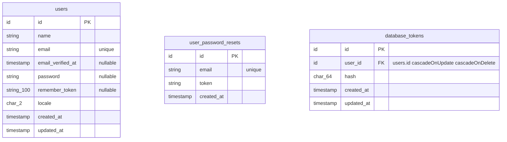

# Database schema

```mermaid
erDiagram

users {
  id id PK
  string name
  string email "unique"
  timestamp email_verified_at "nullable"
  string password "nullable"
  string_100 remember_token "nullable"
  char_2 locale
  timestamp created_at
  timestamp updated_at
}

user_password_resets {
  id id PK
  string email "unique"
  string token
  timestamp created_at
}

database_tokens {
  id id PK
  id user_id FK "users.id cascadeOnUpdate cascadeOnDelete"
  char_64 hash
  timestamp created_at
  timestamp updated_at
}
```
