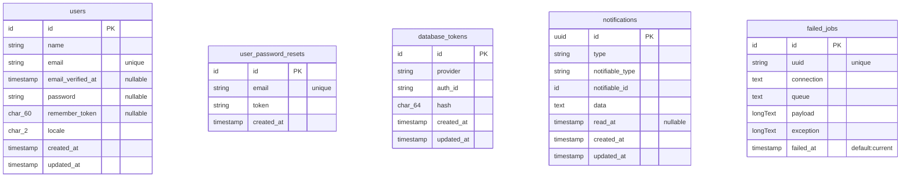

# Database schema

```mermaid
erDiagram

users {
  id id PK
  string name
  string email "unique"
  timestamp email_verified_at "nullable"
  string password "nullable"
  char_60 remember_token "nullable"
  char_2 locale
  timestamp created_at
  timestamp updated_at
}

user_password_resets {
  id id PK
  string email "unique"
  string token
  timestamp created_at
}

database_tokens {
  id id PK
  string provider
  string auth_id
  char_64 hash
  timestamp created_at
  timestamp updated_at
}

notifications {
  uuid id PK
  string type
  string notifiable_type
  id notifiable_id
  text data
  timestamp read_at "nullable"
  timestamp created_at
  timestamp updated_at
}

failed_jobs {
  id id PK
  string uuid "unique"
  text connection
  text queue
  longText payload
  longText exception
  timestamp failed_at "default:current"
}
```
